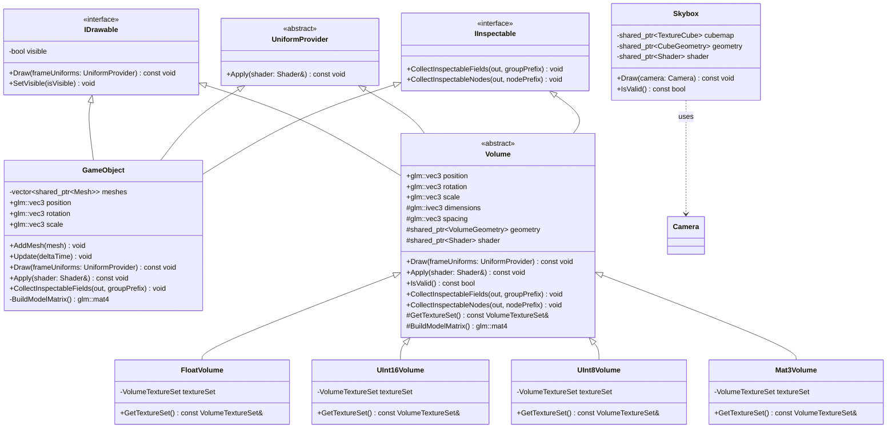
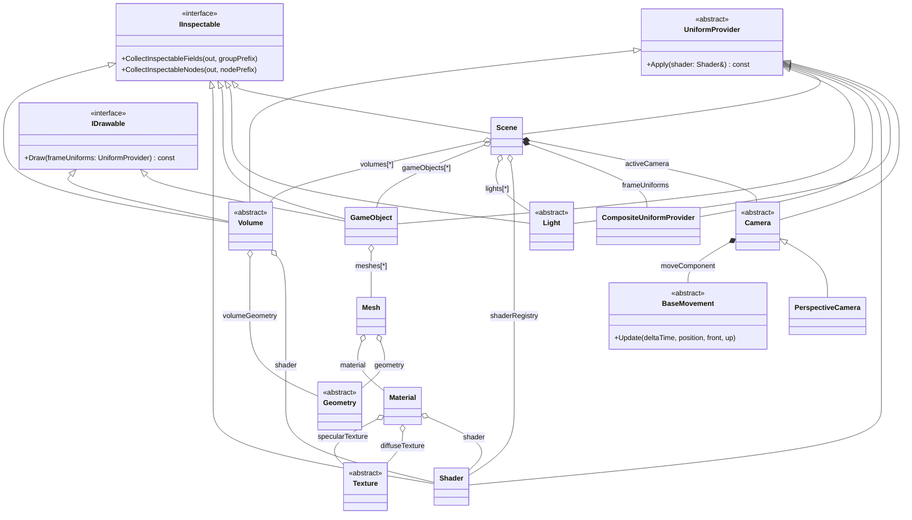
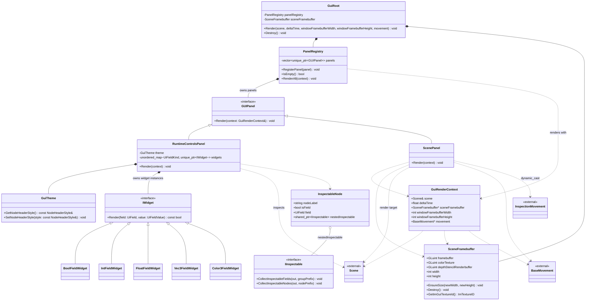
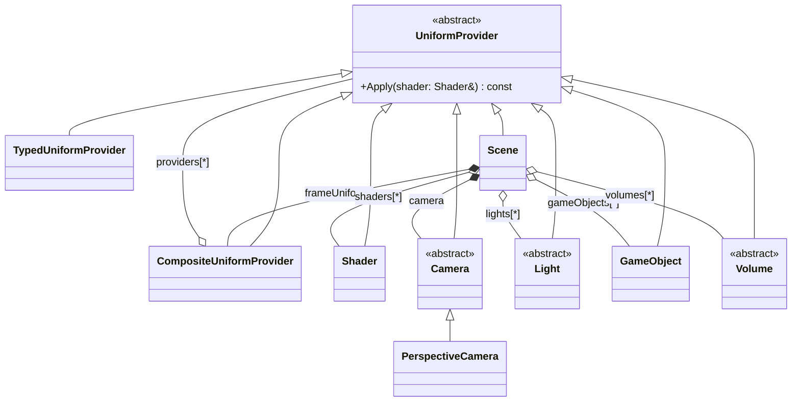
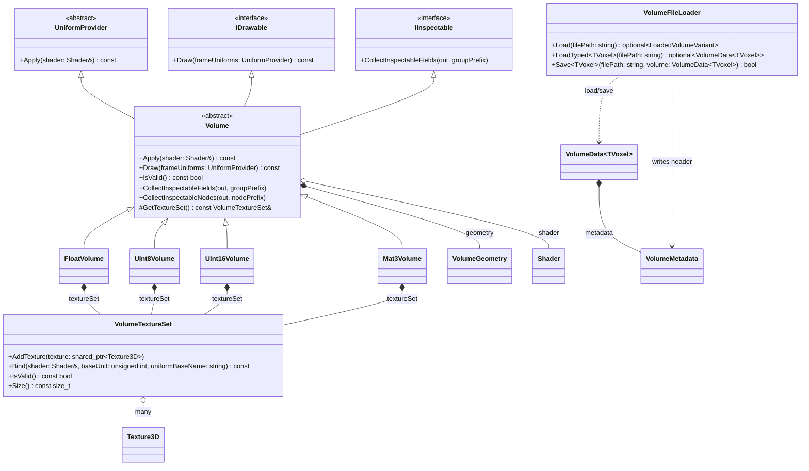
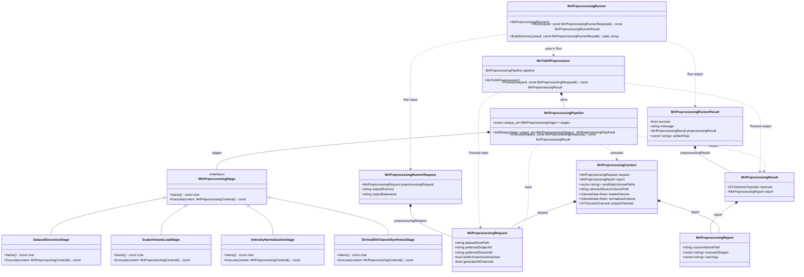
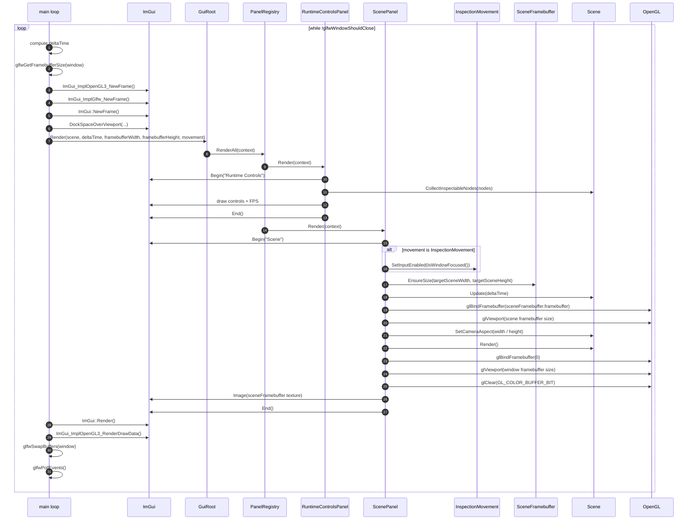
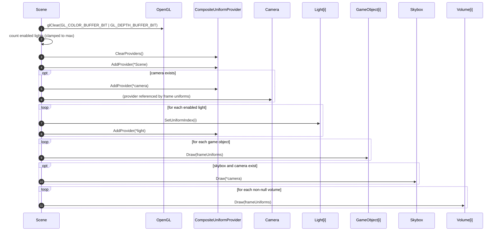
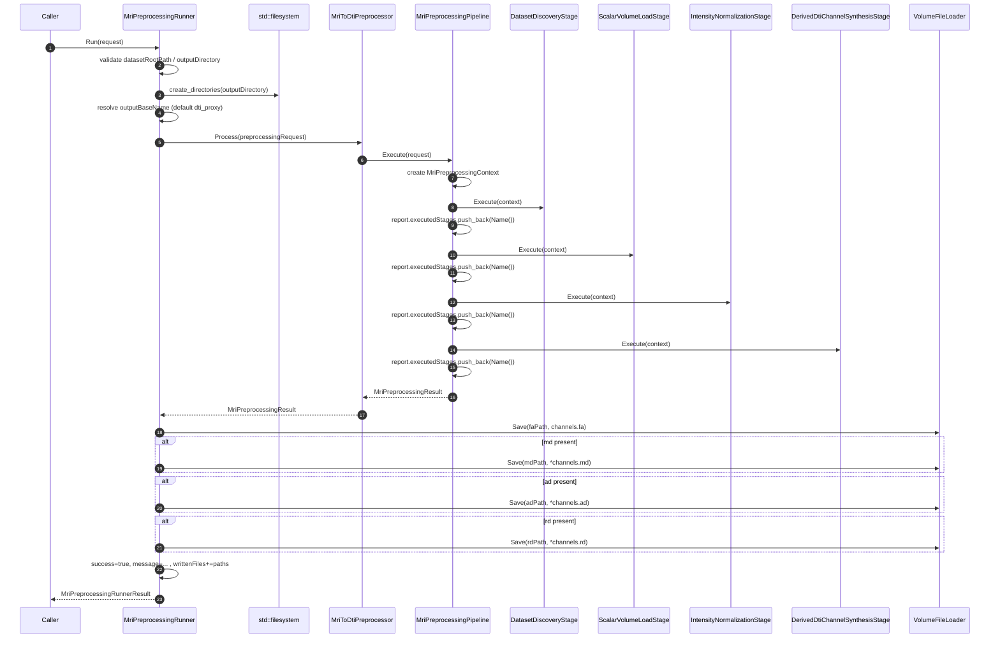

# DTI-MRI-Imaging
Author: Boroczky Balazs

## Developer Environment Setup

This project is a C++17 OpenGL application built with CMake and dependencies managed through vcpkg.

### 1. Prerequisites

- OS: Windows (PowerShell scripts in this repository target Windows)
- Compiler: Visual Studio 2022 with MSVC (Desktop development with C++)
- CMake: 3.20 or newer
- Git
- vcpkg

You can verify tools from a terminal:

```powershell
cmake --version
git --version
cl
```

### 2. Install and Bootstrap vcpkg

This repository expects vcpkg at `C:/vcpkg` by default.

```powershell
cd C:\
git clone https://github.com/microsoft/vcpkg.git
cd C:\vcpkg
.\bootstrap-vcpkg.bat
```

Install required libraries for `x64-windows`:

```powershell
cd C:\vcpkg
.\vcpkg.exe install glm:x64-windows glfw3:x64-windows glad:x64-windows assimp:x64-windows stb:x64-windows imgui[docking-experimental,glfw-binding,opengl3-binding]:x64-windows
```

### 3. Toolchain and Dependency Notes

`CMakeLists.txt` requires these packages:

- `OpenGL`
- `glm`
- `glfw3`
- `glad`
- `assimp`
- `imgui` (with `docking-experimental`, `glfw-binding`, and `opengl3-binding` features)
- `stb_image.h` (provided by vcpkg package `stb`)
- Optional: `ITK` for broad medical volume format support (NIfTI, NRRD, MetaImage, Analyze, DICOM series)

The build script (`build.ps1`) configures CMake with:

```text
-DCMAKE_TOOLCHAIN_FILE=C:/vcpkg/scripts/buildsystems/vcpkg.cmake
```

If your vcpkg location differs, either:

- Set `CMAKE_TOOLCHAIN_FILE` when running CMake manually, or
- Update `build.ps1` and `CMakeLists.txt` to your vcpkg path.

## Build and Run

From repository root:

```powershell
./build.ps1
```

Build configurations:

```powershell
./build.ps1 Debug
./build.ps1 Release
```

Build and run in one command:

```powershell
./build-and-run.ps1
```

## Manual CMake Build (Alternative)

If you prefer plain CMake commands:

```powershell
cmake -S . -B build -DCMAKE_TOOLCHAIN_FILE="C:/vcpkg/scripts/buildsystems/vcpkg.cmake"
cmake --build build --config Release
```

## Output

Expected executable path:

```text
build/Release/app.exe
```

## Volume File Support

- Native format: `VXA1` (`.vxa`) for scalar and matrix data.
- With ITK installed, loader also accepts common medical imaging formats:
	- NIfTI (`.nii`, `.nii.gz`)
	- NRRD (`.nrrd`, `.nhdr` + raw payload)
	- MetaImage (`.mha`, `.mhd` + raw payload)
	- Analyze (`.hdr` + `.img`)
	- DICOM series (directory containing slices)

Install ITK via vcpkg to enable this automatically:

```powershell
cd C:\vcpkg
.\vcpkg.exe install itk:x64-windows
```

## Class Diagrams

### Drawable Layer

This diagram shows how drawable scene entities (`GameObject`, `Volume` variants, and `Skybox`) relate to the core rendering/inspection contracts and shared rendering resources.

Source: [docs/drawable-class-diagram.mmd](docs/drawable-class-diagram.mmd)



### Graphics Pipeline Root

This diagram captures the high-level scene orchestration path, from frame-level uniforms and camera movement down to mesh/material/shader/texture composition and volume rendering roots.

Source: [docs/graphics-pipeline-root-class-diagram.mmd](docs/graphics-pipeline-root-class-diagram.mmd)



### GUI Layer

This diagram documents the ImGui-facing architecture: `GuiRoot` orchestration, panel registration/rendering, widget dispatch, and how GUI context bridges scene state, framebuffer output, and movement controls.

Source: [docs/gui-layer-class-diagram.mmd](docs/gui-layer-class-diagram.mmd)



### Uniform Provider System

This diagram focuses on the uniform application contract and composition path used at frame time, showing which scene actors can contribute uniform state and how providers are aggregated.

Source: [docs/uniform-provider-class-diagram.mmd](docs/uniform-provider-class-diagram.mmd)



### Volume System

This diagram details the volume type hierarchy, rendering contracts, texture-set composition, and how generic volume data metadata and file I/O connect into the runtime volume objects.

Source: [docs/volume-class-diagram.mmd](docs/volume-class-diagram.mmd)



### MRI Preprocessing Pipeline and Runner

This diagram explains the preprocessing flow model: request/context/report/result types, stage-based pipeline execution, preprocessor ownership of the pipeline, and runner orchestration/output persistence.

Source: [docs/preprocessing-pipeline-runner-class-diagram.mmd](docs/preprocessing-pipeline-runner-class-diagram.mmd)



## Sequence Diagrams

### Application Frame and GUI Render Loop

This diagram shows one full UI frame from the main loop through `GuiRoot`, panel rendering, scene-to-framebuffer rendering, and final ImGui draw submission.

Source: [docs/app-frame-sequence-diagram.mmd](docs/app-frame-sequence-diagram.mmd)



### Scene Render Sequence

This diagram focuses on `Scene::Render`: frame uniform setup, enabled light indexing, and draw ordering for game objects, skybox, and volumes.

Source: [docs/scene-render-sequence-diagram.mmd](docs/scene-render-sequence-diagram.mmd)



### MRI Preprocessing Runner Sequence

This diagram traces preprocessing execution from runner input validation to stage-by-stage pipeline execution and channel persistence to `.vxa` files.

Source: [docs/preprocessing-runner-sequence-diagram.mmd](docs/preprocessing-runner-sequence-diagram.mmd)



## Troubleshooting

- `Cannot open include file` errors after header moves:
	- Ensure include subdirectories are listed in `target_include_directories` in `CMakeLists.txt`.
- Missing package errors from CMake:
	- Re-run vcpkg install command for all required packages.
- Runtime missing DLLs:
	- `debug.ps1` copies vcpkg DLLs from `C:/vcpkg/installed/x64-windows/bin`.
